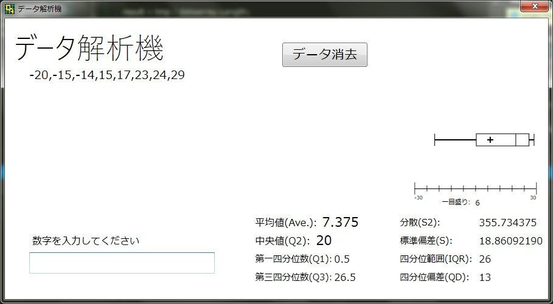

# DataAnalysiser
C#の演習がてら作ったもの。
高校のデータ関連の計算ができる。
.NET Framework 4.5.2 以上で動作保証

##できること
+ 平均値
+ 四分位数
+ 四分位偏差
+ 四分位範囲
+ 分散
+ 標準偏差  
等の計算  
入力したデータを自動ソートしてくれもする。
また、箱ひげ図も表示してくれる  

##外観

##Licence
MIT Licence

##Download
https://github.com/Happa8/DataAnalysiser/releases/latest
